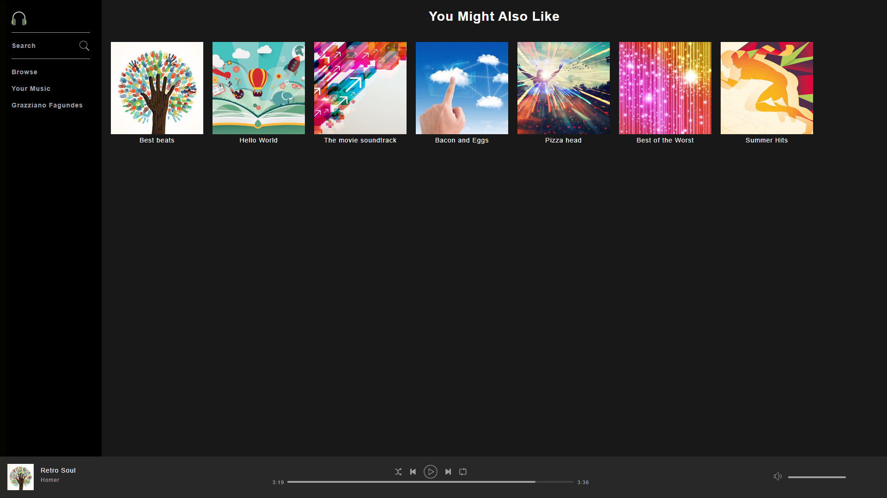
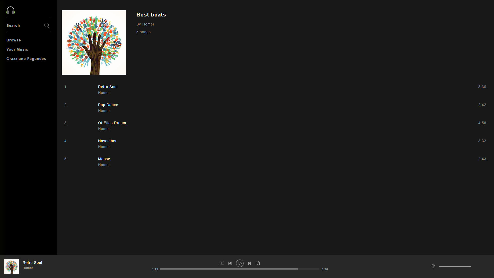
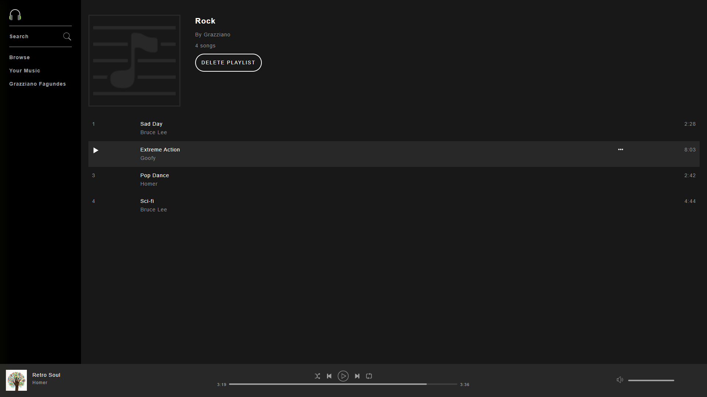
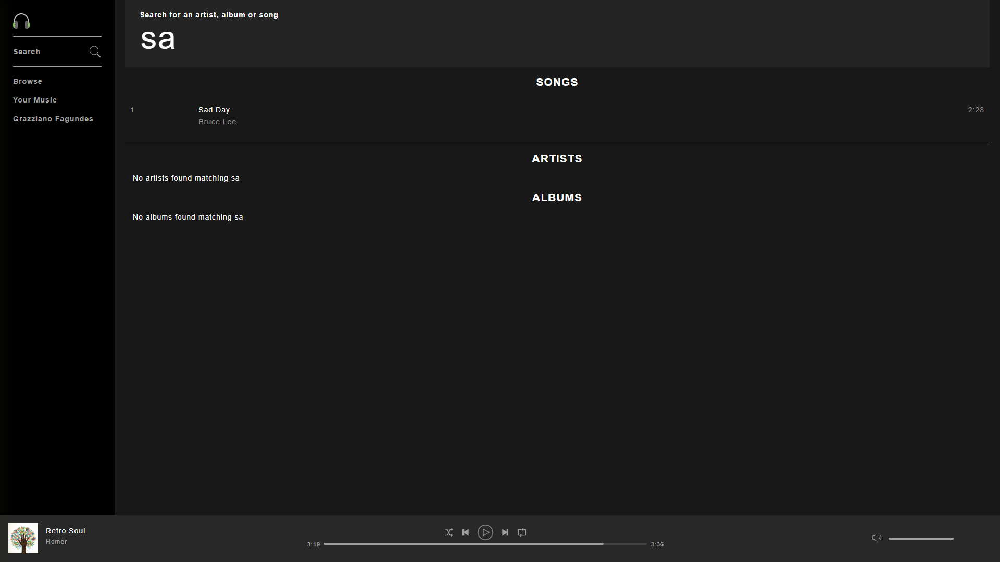

# Slotify 🎶

Slotify é um clone do Spotify, desenvolvido para fins educacionais, com o objetivo de replicar a experiência do usuário na popular plataforma de streaming de música. O projeto inclui funcionalidades como reprodução de músicas, criação de playlists, buscas por artistas, álbuns e muito mais.

## Tecnologias Utilizadas

- **Frontend**: HTML, CSS, JavaScript
- **Backend**: PHP
- **Banco de Dados**: MySQL
- **Player de Música**: HTML5 Audio API
- **Autenticação**: Sessões PHP
- **Estilização**: Bootstrap
- **Hospedagem**: XAMPP, Apache

## Funcionalidades

- **Autenticação de Usuários**: Login e registro de contas utilizando sessões PHP.
- **Reprodução de Músicas**: Player integrado com controles de reprodução.
- **Criação e Edição de Playlists**: Os usuários podem criar, editar e deletar playlists.
- **Pesquisa por Artistas e Álbuns**: Explore e busque por seus artistas, álbuns e faixas favoritas.
- **Interface Responsiva**: A aplicação é otimizada para dispositivos móveis e desktops.
- **Recomendações de Músicas**: Baseado no histórico do usuário.
- **Sistema de Curtidas e Favoritos**: Marque suas músicas e álbuns preferidos.

## Como Rodar o Projeto

### Pré-requisitos

Antes de começar, certifique-se de ter as seguintes ferramentas instaladas em seu sistema:

- XAMPP (ou outro servidor local que suporte PHP e MySQL)
- Git

### Passos para Instalação

1. Clone o repositório:

```bash
git clone https://github.com/Grazziano/Slotify.git
```

2. Acesse o diretório do projeto:

```bash
cd Slotify
```

3. Copie o projeto para o diretório do seu servidor Apache (exemplo: `C:/xampp/htdocs` no Windows):

```bash
cp -r slotify /c/xampp/htdocs/slotify
```

4. Configure o banco de dados MySQL:

- Inicie o servidor MySQL através do XAMPP.
- Acesse o **phpMyAdmin** (geralmente acessível via `http://localhost/phpmyadmin`).
- Crie um banco de dados chamado `slotfy`.
- Importe o arquivo `slotfy.sql` incluído no repositório para criar as tabelas e preencher dados de exemplo.

5. Configure o arquivo de conexão com o banco de dados:

No diretório `config`, edite o arquivo `db.php` com suas configurações de banco de dados:

```php
<?php
$servername = "localhost";
$username = "root";
$password = "";
$dbname = "slotfy";

// Criar conexão
$conn = new mysqli($servername, $username, $password, $dbname);

// Verificar conexão
if ($conn->connect_error) {
    die("Falha na conexão: " . $conn->connect_error);
}
?>
```

6. Execute o projeto:

Abra o navegador e vá para `http://localhost/slotfy`.

## Estrutura do Projeto

```
.
├── assets
│   ├── css
│   ├── img
│   └── js
├── config
│   └── db.php
├── includes
│   ├── footer.php
│   ├── header.php
│   └── navbar.php
├── sql
│   └── slotfy.sql
├── index.php
├── playlists.php
├── player.php
└── search.php
```

## Capturas de Tela 📸

Aqui estão algumas imagens do Slotfy em funcionamento:

### Página Inicial



### Player de Música



### Criação de Playlists



### Busca de Artistas



> **Nota**: As imagens acima são meramente ilustrativas. Elas podem ser substituídas por capturas reais da aplicação após o projeto estar funcionando em seu ambiente.

## Contribuindo

Contribuições são sempre bem-vindas! Se você quiser contribuir com o projeto:

1. Fork este repositório
2. Crie uma nova branch (`git checkout -b feature/nova-feature`)
3. Faça suas modificações
4. Faça um commit das mudanças (`git commit -m 'Add nova feature'`)
5. Faça o push da branch (`git push origin feature/nova-feature`)
6. Abra um Pull Request

## Licença

Este projeto é licenciado sob a Licença MIT. Consulte o arquivo [LICENSE](LICENSE) para mais detalhes.
